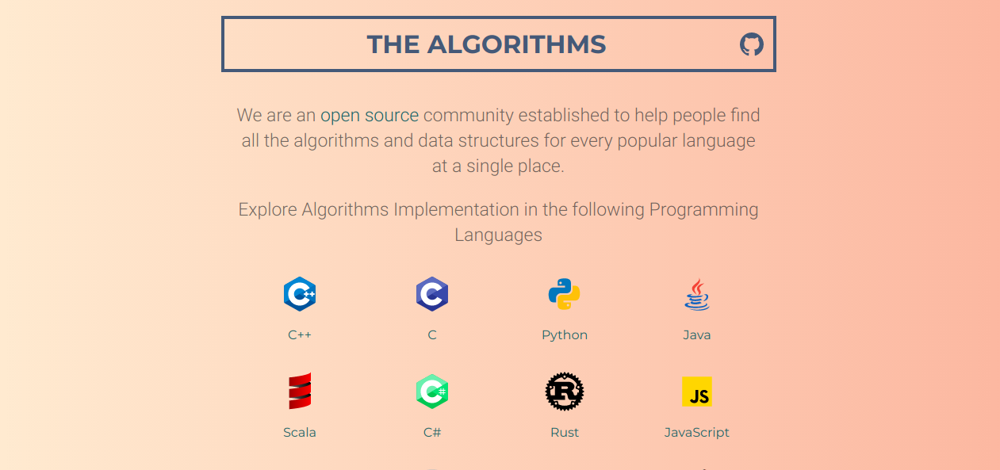

# The Algorithms

### Introductory website to let people get familiar with The Algorithms.
# The programming algorithms which are available for you - 
    1. C++ 
    2. C
    3. Python
    4. Java
    5. Scala
    6. C#
    7. Rust 
    8. JavaScript
    9. Go
    10. R and more...

# Home page -

